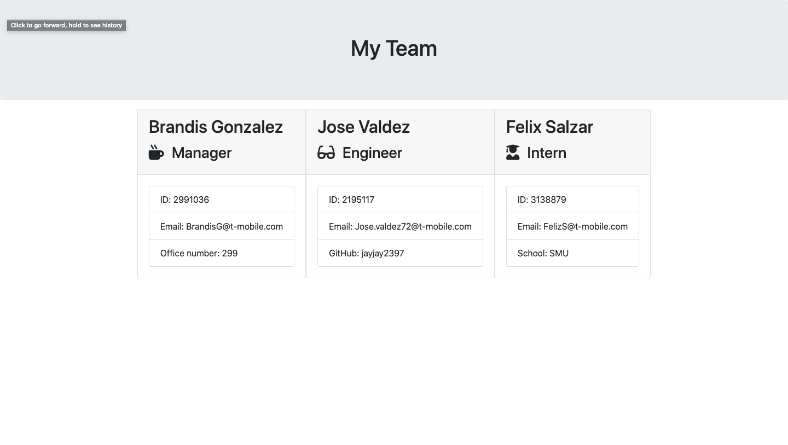

## Team-Profile-Generator 
This application is a team generator that runs of Node and will create / output an HTML with all the information you inputed into the application about the employees.
there is no limit to how many employees you can input. you'll get the choice from three manager , engineer and intern.

## How to use it 
you run "npm install" in the terminal then run "node app.js" and input all the employees information once you've done so , select exit and the team.html will be created.

